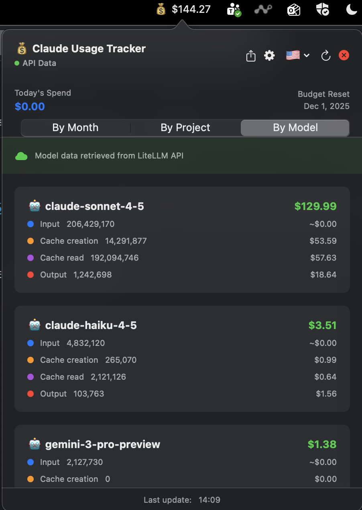

<p align="center">
  
</p>

<h1 align="center">Claude Usage Tracker</h1>

<p align="center">
  A native macOS menu bar app to monitor your Claude Code API usage in real-time. Track costs per month and per project with accurate, automatic updates.
</p>

<p align="center">
  
  
  
</p>

---

## ✨ Features

- **🎯 Accurate Cost Tracking** - Properly groups tool calls and calculates costs per conversation turn
- **📊 Real-time Monitoring** - Current month cost visible in your menu bar
- **🔄 Smart Updates** - Automatic silent updates every minute, manual refresh with visual feedback
- **📄 Pagination System** - View 2 months at a time with elegant navigation controls
- **📅 Monthly Breakdown** - Complete usage history organized by month
- **📁 Project Tracking** - See which projects consume the most tokens
- **📈 Detailed Metrics** - Token breakdown by type:
  - Input tokens
  - Cache creation (write) tokens
  - Cache read tokens
  - Output tokens
- **📤 CSV Export** - Export your data in clean CSV format (by month or by project)
- **⚙️ Configurable Pricing** - Adjust pricing for different Claude models and context windows
- **🌍 Multi-language** - Switch between English 🇺🇸 and Spanish 🇪🇸
- **💱 Currency Conversion** - Automatically shows costs in EUR (€) when Spanish is selected, using daily exchange rates
- **🖥️ Native macOS** - Built with SwiftUI, lightweight and fast
- **🔒 Privacy-first** - All usage data stays local (only fetches exchange rate once per day)
- **🎨 Polished UI** - Clean interface with smooth interactions and auto-close popover

---

## 📸 Screenshots

<p align="center">
  
</p>

### Menu Bar
The app shows your current month's cost in the menu bar:
```
💰 $165.14
```

### Main Panel - By Month
View detailed breakdown by month with token metrics:
```
📅 November 2025          $106.72
   • Input tokens: 41,666 → $0.12
   • Cache creation: 12,367,742 → $46.38
   • Cache read: 155,606,800 → $46.68
   • Output tokens: 902,055 → $13.53

📅 October 2025           $165.14
   • Input tokens: 108,448 → $0.33
   • Cache creation: 14,416,808 → $54.06
   • Cache read: 288,300,577 → $86.49
   • Output tokens: 1,617,636 → $24.26

──────────────────────────────────
TOTAL                     $271.86
```

### Main Panel - By Project
See which projects cost the most:
```
📁 PROJECT-1              $98.45
📁 PROJECT-2              $73.21
📁 PROJECT-3              $42.18
📁 PROJECT-4              $12.34
...
```

### Settings Panel
Configure pricing for different models and context windows:
- Standard Context (≤ 200K tokens)
- Long Context (> 200K tokens)
- Customize rates for each token type

---

## 🚀 Quick Start

### Option 1: Install with Homebrew (Easiest)

```bash
# Add the tap
brew tap SergioBanuls/claudeusagetracker

# Install the app
brew install --cask claudeusagetracker
```

**Or install in one command:**
```bash
brew install --cask SergioBanuls/claudeusagetracker/claudeusagetracker
```

**Benefits:**
- ✅ No need to run `xattr` manually - Homebrew automatically removes quarantine
- ✅ Easy updates: `brew update && brew upgrade claudeusagetracker`
- ✅ Clean uninstall: `brew uninstall --cask claudeusagetracker`

**To update to the latest version:**
```bash
brew update && brew upgrade claudeusagetracker
```

**Important:** Always run `brew update` before `brew upgrade` to ensure Homebrew knows about the latest version. The command above does both in one line.

### Option 2: Download Pre-built App

1. **Download** the latest `.dmg` file from the [Releases](../../releases) page
2. **Open** the DMG file (double-click)
3. **Drag** `ClaudeUsageTracker.app` to the `Applications` folder shortcut
4. **Remove macOS security block** (required for unsigned apps):
   ```bash
   xattr -cr /Applications/ClaudeUsageTracker.app
   ```
5. **Right-click** the app in Applications and select **"Open"** (first time only)
6. Look for the **💰** icon in your menu bar (top-right corner)

> **Note**: Since this app is not signed with an Apple Developer certificate, macOS Gatekeeper will block it by default. The `xattr` command above removes this security block. You may still need to right-click and select "Open" the first time.

### Option 3: Build from Source

#### Prerequisites
- macOS 13.0 (Ventura) or later
- Xcode Command Line Tools installed
- Claude Code CLI with project history

#### Installation Steps

1. **Clone the repository**
   ```bash
   git clone https://github.com/SergioBanuls/ClaudeUsageTracker.git
   cd ClaudeUsageTracker
   ```

2. **Build the app**
   ```bash
   chmod +x build.sh
   ./build.sh
   ```

3. **Run the app**
   ```bash
   open ClaudeUsageTracker.app
   ```

4. **(Optional) Install permanently**
   ```bash
   cp -r ClaudeUsageTracker.app /Applications/
   open /Applications/ClaudeUsageTracker.app
   ```

---

## 📋 How It Works

### Data Source
The app reads Claude Code's local project history files located at:
```
~/.claude/projects/
```

Each project directory contains `.jsonl` files with conversation history and token usage data.

### Processing Logic

1. **Scans** all project directories recursively
2. **Groups** consecutive assistant messages into conversation "turns"
   - Tool calls within the same turn (< 10 seconds apart) are counted as one billable event
   - This prevents double-counting when Claude uses multiple tools
3. **Parses** usage data from each conversation turn
4. **Calculates** costs based on configurable pricing (defaults to Claude Sonnet 4.5):

#### Standard Context (≤ 200K tokens)
- Input tokens: $3.00 per million
- Cache creation (write): $3.75 per million (1.25× input rate)
- Cache read: $0.30 per million (10% of input rate)
- Output tokens: $15.00 per million

#### Long Context (> 200K tokens)
- Input tokens: $6.00 per million
- Cache creation (write): $7.50 per million (1.25× input rate)
- Cache read: $0.60 per million (10% of input rate)
- Output tokens: $22.50 per million

5. **Groups** data by month and project
6. **Displays** results in real-time

### Why This Matters

Without proper turn grouping, tool-heavy conversations could be counted 2-3× higher than actual costs. This app accurately matches what you're billed by grouping all tool calls within a single conversation turn.

---

## 🎯 Usage

### Menu Bar Icon
- Shows current month's cost: **💰 $165.14** (or **€** when Spanish is selected)
- Click to open the detailed panel
- Updates silently every minute in the background
- Click outside the panel to close it

### Main Panel

**Two tabs:**
1. **By Month** 📅 - Monthly breakdown with detailed token metrics (paginated, 2 months per page)
2. **By Project** 📁 - Project-based cost analysis

**Controls:**
- **📤 Export** - Export current view to CSV file
- **⚙️ Settings** - Configure pricing for different models
- **🇺🇸 / 🇪🇸 Language Selector** - Switch between English and Spanish
- **🔄 Refresh** - Manually update data (shows loading spinner)
- **✖️ Close** - Exit the application
- **Last update** - Timestamp of last data refresh (bottom)

### Pagination (Monthly View)

When you have more than 2 months of data:
- **← Newer / Recientes** - Go to more recent months
- **Page indicator** - Shows current page (e.g., "1 / 3")
- **Older / Antiguos →** - Go to older months
- **Total Cost** - Always visible at the bottom, showing grand total

### CSV Export

Export your data for analysis in Excel, Google Sheets, or other tools:

1. Switch to the view you want to export (By Month or By Project)
2. Click the **📤 Export button** in the top-right
3. Choose where to save the file
4. The CSV will include:
   - Month/Project name
   - Token type (Input, Cache Creation, Cache Read, Output)
   - Token count
   - Cost per type
   - Totals for each month/project
   - Grand total

### Settings Panel

Customize pricing to match your Claude API plan:

1. Click the **⚙️ gear icon** in the top-right
2. Adjust pricing for:
   - Standard Context (≤ 200K tokens)
   - Long Context (> 200K tokens)
3. Configure rates for each token type
4. Click **Reset to Defaults** to restore Sonnet 4.5 pricing

### Automatic Updates
- Updates every 60 seconds automatically (silently, no loading indicator)
- Manual refresh shows a loading spinner for user feedback
- Menu bar currency updates instantly when changing language

---

## 🛠️ Project Structure

```
ClaudeUsageTracker/
├── ClaudeUsageTrackerApp.swift    # App entry point & menu bar
├── ClaudeUsageManager.swift       # Data parsing, turn grouping & cost calculations
├── PricingManager.swift            # Configurable pricing tiers
├── LocalizationManager.swift       # Multi-language support (EN/ES)
├── MainView.swift                  # SwiftUI main interface
├── SettingsView.swift              # Pricing configuration UI
├── Assets.xcassets/                # App icons & resources
├── ClaudeUsageTracker.entitlements # macOS permissions
├── build.sh                        # Build script
├── create_release.sh               # Release packaging script
└── README.md                       # This file
```

---

## 🐛 Troubleshooting

### App shows $0.00

**Solution 1**: Wait a few seconds or click the 🔄 refresh button

**Solution 2**: Verify that `~/.claude/projects/` exists and contains data:
```bash
ls ~/.claude/projects/
```

**Solution 3**: Check that you have Claude Code installed and have used it

**Solution 4**: Look in Console.app for any error messages from ClaudeUsageTracker

### App doesn't appear in menu bar

- Check Activity Monitor for "ClaudeUsageTracker"
- Try quitting and reopening the app
- Grant necessary permissions in System Settings > Privacy & Security

### Costs seem too high

- The app now properly groups tool calls into conversation turns
- Check Settings (⚙️) to ensure pricing matches your API plan
- Compare with your actual Anthropic/Vertex AI bill to verify accuracy

### Build fails

Make sure Xcode Command Line Tools are installed:
```bash
xcode-select --install
```

Verify you're on macOS 13.0 or later:
```bash
sw_vers
```

### Costs don't match my bill

1. **Check currency**: The app shows USD. Convert if your bill is in another currency
2. **Verify pricing**: Click ⚙️ Settings and ensure rates match your API plan
3. **Time period**: Ensure you're comparing the same time period
4. **Billing source**: Claude Code (Anthropic API) vs Vertex AI may have different billing

---

## 🔧 Advanced Configuration

### Change Update Frequency

Edit `ClaudeUsageTrackerApp.swift`:
```swift
// Default: 60 seconds (1 minute)
timer = Timer.scheduledTimer(withTimeInterval: 60, repeats: true) { ... }
```

### Adjust Turn Grouping Threshold

Edit `ClaudeUsageManager.swift` (line ~145):
```swift
// Default: 10 seconds
if timeDiff > 10 || role != "assistant" {
    isNewTurn = true
}
```

---

## 🤝 Contributing

Contributions are welcome! Please feel free to submit a Pull Request.

1. Fork the repository
2. Create your feature branch (`git checkout -b feature/AmazingFeature`)
3. Commit your changes (`git commit -m 'Add some AmazingFeature'`)
4. Push to the branch (`git push origin feature/AmazingFeature`)
5. Open a Pull Request

See [CONTRIBUTING.md](CONTRIBUTING.md) for detailed guidelines.

---

## 📝 License

This project is licensed under the MIT License - see the [LICENSE](LICENSE) file for details.

---

## 🙏 Acknowledgments

- Built with SwiftUI and native macOS frameworks
- Inspired by the need to accurately monitor Claude API costs
- Thanks to the Claude Code team for maintaining local project history
- Special thanks to the open-source community

---

## 📧 Support

If you have questions, suggestions, or issues:

- **Open an issue** on [GitHub Issues](../../issues)
- **Check existing issues** before creating a new one
- **Provide details**: OS version, Claude Code version, and steps to reproduce

---


**Made with ❤️ for the Claude Code community**
